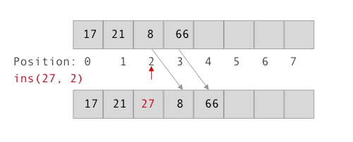

# Data Structure 👀
Implemented abstract data types and algorithms including linked list, binary search tree, minimum binary heap tree, splay tree, directed graph with topo sort, and Dijkstra’s single source shortest path algorithm in java.

# Summary
| Data Structure | Solution |
| :------------ | :----------: |
| Linked List |[LinkedListImpl.java](LinkedList_A1/src/LinkedList_A1/LinkedListImpl.java) |
| Binary Search Tree | |
| Minimum Binary Heap Tree | |
| Splay Tree | |
| Directed Graph with Topo Sort | |
| Dijkstra's single source shortest path | |

## Overview

Most data structures have at least 3 kinds of operations. `ADD` an item (build a structure), `REMOVE` an item (un-build a structure) and `FIND` an item (search a structure).

## List 

List operators: `new`, `ins`, `rem`, `get`, `find`, `size`, `empty`. A list starts with the first element in positio `0`. If we have a list size of `N`, then the position should be between `0` and `N-1`.

### List Behaviors

* Empty list have size 0.
* On `ins`, size of list increases by at most 1.
* On `ins`, the sequence of original elements remain the same.
* On `rem`, size of list decreases by at most 1.
* On `rem`, the sequence of remaining elements remain the same.
* No maximum limit for the size of a list. 

### List implementation

There are two main ways to implement a list: `Array` and `Linked List`.

#### Array

Time complexity of operations.

* **ins**. `O(n)`. Consider worst case, insert an el to position `0`, then need move all `N` els backwards.
* **rem**. `O(n)`. Same reason as `ins`.
* **get**. `O(1)`. Get an el directly by index (position), we also say constant time.
* **find**. `O(n)`. Content searching. 
* **empty**. `O(1)`. 
* **size**. `O(1)`. 

#### Linked List

Time complexity of operations.

* **insCell**. `O(1)`. Move 2 link pointers.
* **remCell**. `O(1)`. 
* **ins(e, i)**. `O(n) get` + `O(1) insCell` => `O(n)`
* **rem**. `O(n) get` + `O(1) remCell` => `O(n)`.
* **get**. `O(n)`. No index like array.
* **find**. `O(n)`. content searching.
* **empty**. `O(1)`.
* **size**. `O(n)`. Or `O(1)` if keep a counter. (tradeoff between time and space).

### Build on List

`Stack` and `Queue` are `Lists` with special access disciplines. *No find (search)* by content and *No get (go into center of the list)*, which gives efficient implementation benefits.

#### Stack 

LAST IN FIRST OUT (LIFO), access top only. 

* **top(get)**. `O(1)`. Only top item available. 
* **push(ins)**. `O(1)`. 

#### Queue

FIST IN FIRST OUT (FIFO), access bottom only.

For linked impl. 
* **enq**. `O(1)`. 
* **deq**. `O(1)`. 

For array impl. 
* **enq**. `O(1)`. Add an el at the end of the array.
* **deq**. `O(n)`. Delete the first el of the array thus need move `N-1` els from position 1 to `N-1` forward.

## Acknowledgement 

